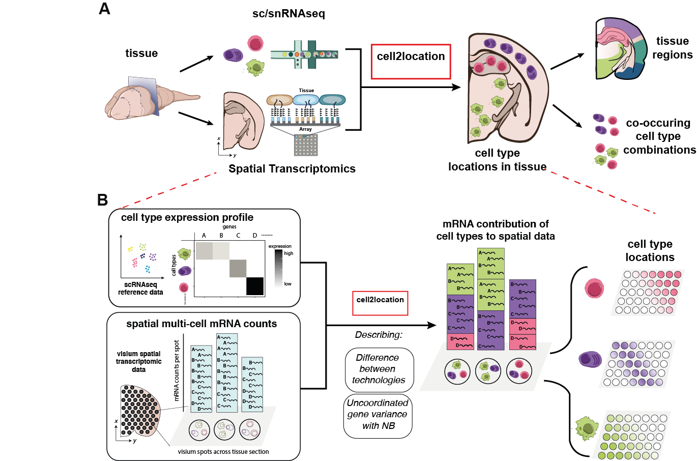

# cell2location
### Highthroughput spatial mapping of cell types with single cell and spatial sequencing

cell2location is a Bayesian model that integrates single-cell RNA-seq (scRNA-seq) and multi-cell spatial transcriptomics to spatially map cell types from the same tissue (Fig 1A). cell2location leverages reference signatures that are estimated from scRNA-seq profiles, for example using conventional clustering followed by estimation of average gene expression profiles. Based on these reference signatures, mRNA contributions from each of the defined cell types are estimated at each location in the spatial data, which gives rise to both cell type proportions as well as absolute densities of cell types in a spatially resolved manner. Computationally, this is achieved via a hierarchical non-negative decomposition of the gene expression profiles at spatial locations (each with multiple cells) into the reference signatures of cell types and cell states (Fig 1B). Robustness of the model is enabled by modelling differences between technologies using scaling factors, and employing a flexible negative binomial error model to account for technical and unexplained variation. Finally, cell2location is computationally efficient, owing to variational approximate inference.

   
Fig 1. Cell2location model for spatial mapping of comprehensive cell type references.    
A. Overview  of the spatial mapping workflow that is enabled by cell2location. Spatial transcriptomics data are decomposed into cell type abundance estimates, using a scRNA-seq based cell type reference from the same tissue.    
B. Basic principles of the strategy employed by cell2location.    

## Installation

Prior to intalling cell2location package you need to install miniconda and create a conda environment containing pymc3 and theano ready for use on GPU. Follow the steps below:

If you do not have conda please install Miniconda first:

```bash
cd /path/to/software
wget https://repo.anaconda.com/miniconda/Miniconda3-latest-Linux-x86_64.sh
bash Miniconda3-latest-Linux-x86_64.sh
# use prefix /path/to/software/miniconda3
```

## Configure environment

Install packages needed for pymc3 and scanpy to work

### Method 1: Create environment from file

Create `cellpymc` environment from file

```bash
conda env create -f environment.yml
```

This will install all the conda and pip required packages.

### Method 2: Create conda environment manually

Create conda environment with the required packages

```bash
conda create -n cellpymc python=3.7 numpy pandas jupyter leidenalg python-igraph scanpy \
louvain hyperopt loompy cmake nose tornado dill ipython bbknn seaborn matplotlib request \
mkl-service pygpu --channel bioconda --channel conda-forge
```

Do not install pymc3 and theano with conda because it will not use the system cuda and we had problems with cuda installed in the local environment, install them with pip

```bash
pip install plotnine pymc3 torch pyro-ppl
```

## Install `cell2location` package

```bash
pip install git+https://github.com/BayraktarLab/cell2location.git
```

## Usage

See [cell2location short demo Jupyter notebook](https://github.com/BayraktarLab/cell2location/blob/master/notebooks/cell2location_short_demo.ipynb) for usage example.

## API details

Models are implemented as dedicated python classes organised in an [inheritance hierarchy](https://github.com/BayraktarLab/cell2location/blob/master/cell2location/models/README.md) to enable reusing methods between models.  
