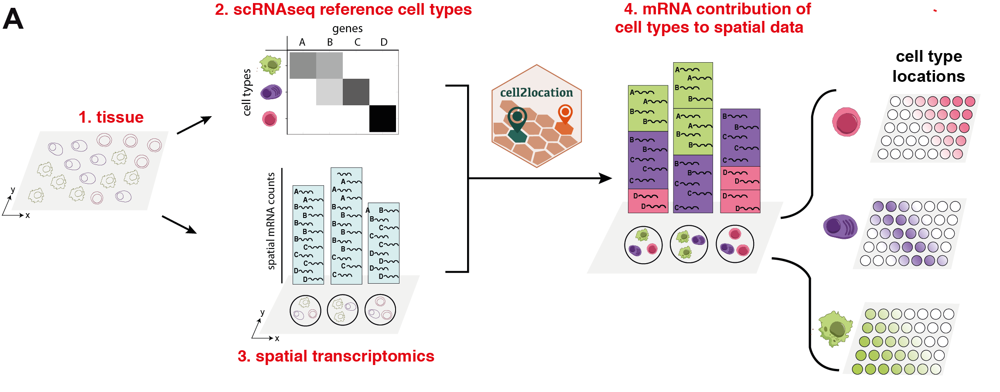

### Highthroughput spatial mapping of cell types with single cell and spatial sequencing

Cell2location maps the spatial distribution of cell types by integrating single-cell RNA-seq (scRNA-seq) and multi-cell spatial transcriptomic data from a given tissue (Fig 1). Cell2location leverages reference cell type signatures that are estimated from scRNA-seq profiles, for example as obtained using conventional clustering to identify cell types and subpopulations followed by estimation of average cluster gene expression profiles. Cell2location implements this estimation step based on Negative Binomial regression, which allows to robustly combine data across technologies and batches. Using these reference signatures, cell2location decomposes mRNA counts in spatial transcriptomic data, thereby estimating the relative and absolute abundance of each cell type at each spatial location (Fig 1). 
Cell2location is implemented as an interpretable hierarchical Bayesian model, (1) providing principled means to account for model uncertainty; (2) accounting for linear dependencies in cell type abundances, (3) modelling differences in measurement sensitivity across technologies, and (4) accounting for unexplained/residual variation by employing a flexible count-based error model. Finally, (5) cell2location is computationally efficient, owing to variational approximate inference and GPU acceleration. For full details and a comparison to existing approaches see Suppl. Methods. The cell2location software comes with a suite of downstream analysis tools, including the identification of groups of cell types with similar spatial locations.


   
Overview of the spatial mapping approach and the workflow enabled by cell2location. From left to right: Single-cell RNA-seq and spatial transcriptomics profiles are generated from the same tissue (1). Cell2location takes scRNA-seq derived cell type reference signatures and spatial transcriptomics data as input (2, 3). The model then decomposes spatially resolved multi-cell RNA counts matrices into the reference signatures, thereby establishing a spatial mapping of cell types (4).    

## Usage and Tutorials

Tutorials covering the estimation of expresson signatures of reference cell types (1/3), spatial mapping with cell2location (2/3) and the downstream analysis (3/3) can be found here: https://cell2location.readthedocs.io/en/latest/

There are 2 ways to install and use our package: setup your own conda environemnt or use our singularity and docker images. See below for details.

## Installation of dependecies and configuring environment

Prior to installing cell2location package you need to install miniconda and create a conda environment containing pymc3 and theano ready for use on GPU. Follow the steps below:

If you do not have conda please install Miniconda first:

```bash
cd /path/to/software
wget https://repo.anaconda.com/miniconda/Miniconda3-latest-Linux-x86_64.sh
bash Miniconda3-latest-Linux-x86_64.sh
# use prefix /path/to/software/miniconda3
```

Install packages needed for pymc3 and scanpy to work

### Method 1: Create conda environment manually

Create conda environment with the required packages

```bash
conda create -n cellpymc python=3.7 numpy pandas jupyter leidenalg python-igraph scanpy \
louvain hyperopt loompy cmake nose tornado dill ipython bbknn seaborn matplotlib request \
mkl-service pygpu --channel bioconda --channel conda-forge
```

Do not install pymc3 and theano with conda because it will not use the system cuda and we had problems with cuda installed in the local environment, install them with pip

```bash
pip install plotnine pymc3 torch pyro-ppl
```

### Method 2: Create environment from file

Create `cellpymc` environment from file

```bash
git clone https://github.com/BayraktarLab/cell2location.git
cd cell2location
conda env create -f environment.yml
```

This will install all the conda and pip required packages.

## Install `cell2location` package

```bash
pip install git+https://github.com/BayraktarLab/cell2location.git
```

## Using docker image

Coming soon.

## Using singularity image

Coming soon.

## Documentation and API details

User documentation is availlable on https://cell2location.readthedocs.io/en/latest/. 

The architecture of the package is briefly described [here](https://github.com/BayraktarLab/cell2location/blob/master/cell2location/models/README.md). Cell2location architecture is designed to simplify adding extended versions of the model that can account for additional technical and biologial information. We plan to provide a tutorial showing how to add new model classes but please get in touch if you would like to contribute or build on top our package.
